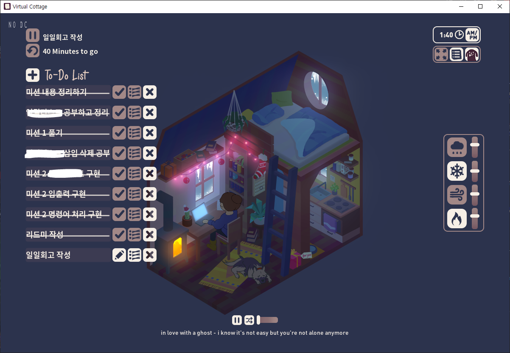
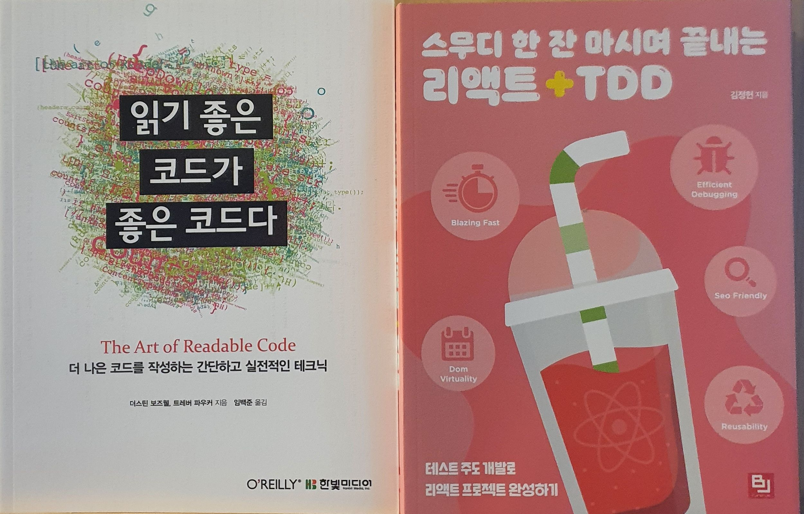

__💡 코드스쿼드 마스터즈 CS 과정의 일일 회고글입니다. 현재 글에서 사용 중인 일일 회고의 양식은 [<U>일일회고 양식 ver.코드스쿼드</U>](https://hemudi.github.io/diary/daily-retrospective-form/)를 참고해주세요.__
{: .notice--warning}

# __💭 Daily Step__
## __✓ BACK STEP__
### __시간을 효과적으로 사용하지 못함__
  - 적당히 미션 풀다 적당히 끊고 쉬고 적당히 다시 미션을 풀어야 하는데 쉬는 시간 없이 계속해서 미션을 풀려고 하다보니 어느순간부터 집중력이 흐트려졌다.
  - 가능하면 오늘 중으로 미션을 어느정도 다 끝내버리고 싶은 마음에...계속 붙잡고 있었는데 한번 집중이 흐트려지니 자꾸 딴 생각이나서 계속 붙잡고 있던거에 비해선 효율이 안난거 같다.
  - 오늘도 __[Virtual Cottage](https://store.steampowered.com/app/1369320/Virtual_Cottage/)__ 를 활용해서 시간 관리를 좀 하면서 차근차근 하나씩 하려고 했는데 타이머를 50분 걸어놓고 타이머가 끝나면 조금만 더 하면 풀릴거 같아서 다시 타이머 돌리고 이랬다.
  - 내일은 걸어놓은 타이머가 끝나면 최소 5분 정도는 아예 쉬어버리고 다시 공부를 시작하자.
  - 뽀모도로가 괜히 효과적인 학습법이 아니야~ __໒(^3^)७✎▤__

### __Jest__
  - 오늘 드디어 Jest 를 활용 할 수 있을거 같은 구현 미션이 나와서 설렜는데 활용을 못했다...
  - 어디서 얼만큼을 테스트 범위로 잡아야할지도 가늠이 안가고 테스트 결과값들은 또 어떻게 해야할지 고민하다가 그냥 구현부터 하자...하고 넘겼다.
  - 연습이 필요하다.

### __알고리즘__
  - 1일 1알고리즘을 못하고 있다.
  - 미션 핑계를 대기는 하지만 그래도 충분히 짬을 내서 풀 수 있을거 같은데...ㅠ.

## __✓ ONE STEP__
### __선 학습 후 미션 풀이 성공__
  - 어제 다짐한대로 미션 해결이 목적이 아닌 학습을 목적이라 생각하고 미션에 임했다.
  - 미션에서만 쓰이는 개념들만 공부하는 빵꾸 학습을 하지 않고 일단 필요하다 나온 배경 지식들에 대해 먼저 전부 꼼꼼히 학습했다.
  - 동시에 정리도 해가면서 학습을 하니 평소보다는 미션을 시작하는 시간이 많이 늦어졌다.
  - 그래도 확실히 한번 꼼꼼히 공부를 하고 정리도 한 뒤에 미션을 시작하니까 예전처럼 하다가 다시 찾아보고 하다가 다시 찾아보는 일은 많이 줄고 미션 구현에만 옴팡 집중 할 수 있었다!
  - 그래서 약간 학습하는 시간은 길어졌지만 미션 구현 시간은 줄어든 기분! 플러스 마이너스 제로! 이 밸런스를 적당히 잘 유지하는게 관건인거 같다.
  - [오늘 학습한 Linked List 정리 글]()

### __Mission All Clear!!__
  - 오늘 미션은 처음에 해석이 어려웠지만 막상 풀고나니 비교적 쉽게 구현을 할 수 있었다.
  - 구현하기 전에는 왜 난이도가 하인지 웅성웅성했는데 풀고나니 하까지는 아니지만 어느정도 납득은 할 수 있었다.
  - 그래서 오늘 가능하면 주어진 요구사항들은 전부 구현하고 싶었고 Virtual Cottage 와 함께 하나씩 차근차근 해서 전부 클리어 했다!
  - 너무 뿌듯해! __＼＼\(۶•̀ᴗ•́)۶//／／__
  - 역시 학습을 먼저 각잡고 한 덕인거 같다!
  - 끝에가선 집중력이 엄청 떨어져서 질질 끌린 면이 있지만 그래도 결국 잠자기 전에 다 끝내서 뿌듯하다!

  

## __✓ NEXT TODO__
- [X] Random 함수
  - 오늘 JavaScript 의 Random 함수를 처음 써봤다.
  - Java의 Random 함수랑 사용법이 크게 차이나지 않는거 같다.
- [ ] Data Structure
  - 오늘 Linked List 를 학습했는데 Linked List 를 포함한 JavaScript 의 자료구조를 전반적으로 한번 더 공부해야 할 것 같다.
  - 마스터즈를 시작하기 전에 유데미의 콜트쌤 강의로 자료구조 스터디를 통해서 주요 구조들은 한번씩 찍먹은 해봤는데 막상 오늘 실전에 사용하려고 보니 바로 생각이 안나는 부분이 많아 다시 처음부터 공부했다.
  - 오늘 미션도 다 푼 김에 내일 정규시간에 콜트쌤 자료구조를 한번 더 정리하면서 공부할까 싶다.
- [ ] inspector
  - 소코반 구현할때 readline 으로 비동기 입력 받는 로직을 node 의 inspector 라는걸 사용해서 디버깅 했었는데 오늘 그걸 또 사용하려고 하니까 어째선지 잘 되지 않았다ㅠ
  - 내일 다시 추가적인 예외 처리 로직들을 구현하면서 다시 재시도 해볼 예정이다.
  - 한번 싹 정리해서 포스팅할까도 고민!!
- [ ] 미션 관련 할일
  - [ ] id 랜덤 생성 중복 예외 처리
  - [ ] 중복 id clip 추가 예외 처리

 
---
 

# __💬 주절주절__
### __보람찬 하루 ^0^)/__
미션을 다 끝내니 너무 보람차고 성취감 있는 하루였다!  
리드미를 작성하는건 정말 너무 힘들었지만 막상 다 하고나니 그래도 역시 뿌듯하고 그것 역시 성취감이 ^//^)  
내일도 열심히하자!  

### __오전의 책 지름__

오전에 알라딘을 잠깐 들어갔다가 충동적으로 책을 질러버렸다.  
포키가 열심히 읽고 계시고 저번에 한번 게더에서 추천해준 ``읽기 좋은 코드가 좋은 코드다`` 랑 ``스무디 한 잔 마시며 끝내는 리액트 + TDD`` 를 충동적으로 질러버렸다! 쉴때마다 조금씩 읽을까 한다.  

### __미션 외 공부__
미션 외의 개인 공부를 뭐를 할까 고민 중이다.  
원래는 스터디나 프로젝트를 할까 했는데 그냥 공부나 더 하는게 나은거 같다.  
그래서 지금 네트워크랑 node.js, react, database 중에서 고민인데...  
네트워크를 먼저 할까 싶다.  
제일 못하고, 나중에 코드스쿼드 과정을 통해 학습 할 수 있을거 같은 나머지들과는 달리 네트워크는 혼자 해야 될거 같다.  
그래서 만약 네트워크를 한다면 예전에 사두고 방치 중인 ``모두의 네트워크``랑 ``그림으로 배우는 Http`` 를 공부할까 싶다.  
내일 책들을 보면서 각을 한번 잡고 계획을 세워보려고 한다.  
화이팅~!  