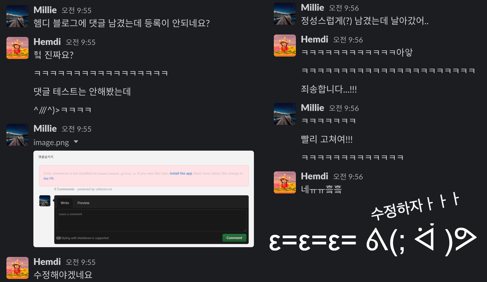

__💡 코드스쿼드 마스터즈 CS 과정의 일일 회고글입니다. 현재 글에서 사용 중인 일일 회고의 양식은 [<U>일일회고 양식 ver.코드스쿼드</U>](https://hemudi.github.io/diary/daily-retrospective-form/)를 참고해주세요.__
{: .notice--warning}

# __💭 Daily Step__
## __✓ BACK STEP__
### __말말말__
- 오늘 그룹리뷰를 하면서 또 느꼈는데 말을 자꾸 요점 없이 횡설수설하는데 그러다보면 내 말에 확신이 없어 말 끝을 흐리게 된다.
- 그러다보니 정보 전달도 제대로 안되는거 같고ㅠ...
- 틀리면 누군가 지적해주실거고 지적을 받는게 나쁜게 아니라 새로운걸 알 기회라고 생각하며 자신 있게 말하는 연습을 해야겠다.
  
### __컨디션__
- 어제 미션을 너무 무리해서 풀다가 잠을 별로 못잤더니 오늘 컨디션이 별로 좋지 못했다.
- 그래도 하려던건 다 하긴해서 괜찮지만...너무 힘들었다.
- 앞으로는 무슨 일이 있어도 최대한 새벽 2시 전에는 자는걸로...ㅠ
- 이제 제에에발 가능하면 back step 에 컨디션과 관련 된 내용을 쓰지 않았으면 좋겠다.
  
### __칭찬__
- 누군가 칭찬을 해주시면 칭찬을 있는 그대로 받아들이지 못하고 자꾸 부정하게 된다.
- 그런 태도가 칭찬을 해주시는 분 입장에선 그 분의 말을 부정하게 되는거라 예의가 아니라는 말을 예전에 들은적이 있다.
- 그래서 누군가 칭찬을 해주시면 그게 내가 어떻게 느끼든간에 해주시는 분의 생각이니 감사하다 하고 순순히 수용해야 한다고 생각하는데....
- 근데 잘 안된다...ㅠ 칭찬 알레르기라도 있는지 칭찬만 들으면 자꾸 아닙니다가 반사적으로 튀어나온다...ㅠ
- 앞으로는 가능하면 아유 아닙니다가 아니라 아유 감사합니다라고 하도록 노력을 해야겠다...!

## __✓ ONE STEP__
### __코드리뷰 피드백__
- 오늘 코드리뷰를 조원 분들의 기스트에 댓글로 피드백을 남기는 방식을 사용했다.
- 그래서 최대한 도움이 될 수 있을만한 피드백을 드리고 싶어서 노력했다.
- 노력을 하긴 했는데...코드를 꼼꼼히 읽으려다보니 생각보다 시간이 오래걸려 피드백을 제대로 정리를 못했다.
- 내가 드린 피드백들이 아쉬운 부분들이 많긴한데 그래도 다른 분들의 코드를 읽고 이해하는데 노력을 했다는 점에서 ONE STEP 에...^^ㅎㅎ

### __적당히 쉬고 적당히 코딩하고__
- 오늘은 어제 다짐했던 대로 시간을 정해놓고 코딩하다가 시간이 다 되면 잠시 쉬고 다시 시간 정해 코딩하고를 반복했다.
- 그렇게 하니 수면 부족으로 컨디션이 별로였는데도 하루를 공치지 않았다!

### __추가 로직 구현__
- 어제 미션에서 추가로 구현하려고 했던 기능들을 다 구현했다.
- 아이디의 중복 생성을 방지하는 기능과 중복 id clip 을 사용하려고 할때 방지하는 기능을 구현했다.
- 추가로 오늘 늦은 밤에 게더에서 도트와 도니, 쥬가 함께 도트의 코드 중에서 id 를 이용한 remove 함수를 고민하시는걸 구경하다가 문득 내 코드에서는 해당 로직이 입력 받은 id 로 바로 제거할 노드를 탐색하고 삭제하는게 아니라 먼저 그 id 로 탐색을 해서 제거하려는 노드의 index 를 구하고 그 index 를 이용해 다시 탐색을 해 제거를 하는 식으로 비효율적으로 구현이 되어있다는걸 깨달았다.
- 그래서 그 부분에 대해서 다시 급하게 수정했다.
- 정말 다른 분들의 코드를 보다보면 배우는게 참 많은거 같다.

## __✓ NEXT TODO__
- [ ] inspector
  - 오늘 밀리도 inspector 를 사용해보려고 했는데 정상적으로 작동되지 않으셨다고 한다.
  - 나만 안되는게 아니었다...!!
  - 그래서 원래는 미션도 얼추 끝냈으니 나중에 시간이 될때 천천히 찾아보려고 했는데 그냥 내일 빨리 inspector 가 왜 안되는지 찾아보려고 한다.
 
---
 

# __💬 주절주절__
### __블로그 오류 접수__

  
오늘 아침 밀리에게 블로그 댓글이 등록이 안된다는 오류를 접수 받았다...!  
블로그에 누가 댓글을 달아줄거라곤 생각도 못해봐서 대충 추가하다 말았는데ㅎㅎ ^//^)>  
호다닥 찾아보니 그냥 utterance 가 제대로 설치가 안되서 그런거였다ㅎㅎ  
다시 재설치를 하고 나니 정상적으로 댓글이 등록이 된다!  

### __쌓여가는 미완성 포스팅__
블로그에 올리고 싶어 조금씩 작성해두다 완결내지 못한 포스팅들이 넘치고 있다.  
Jest 도 있고...자료구조 관련 포스팅도 있고...리눅스도 있고....  
시작을 했으면 빨리 완성을 내서 올려야 하는데 생각보다 글을 쓸 시간이 부족한거 같다.  
그래도 이번 주 주말에 가능하면 미완성된 포스팅들을 해결하고 싶다.  

### __읽기 좋은 코드가 좋은 코드다__
오늘 코딩하다 쉬면서 짬짬히 어제 샀던 읽기 좋은 코드가 좋은 코드다를 70 페이지 정도 읽었다.  
생각보다 내용이 도움이 되는 부분이 많은거 같아서 재미있었다.  
한번 완독하고 난 뒤에 특히 도움이 되고 써먹을 수 있을만한 부분들을 따로 정리해서 포스팅하고 싶다.  
이렇게 또...쌓여가는 미완성 포스팅...?....  