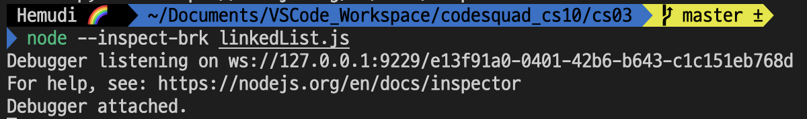
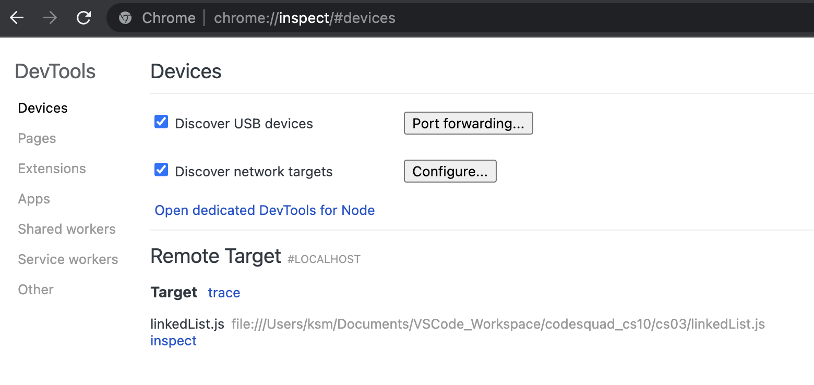
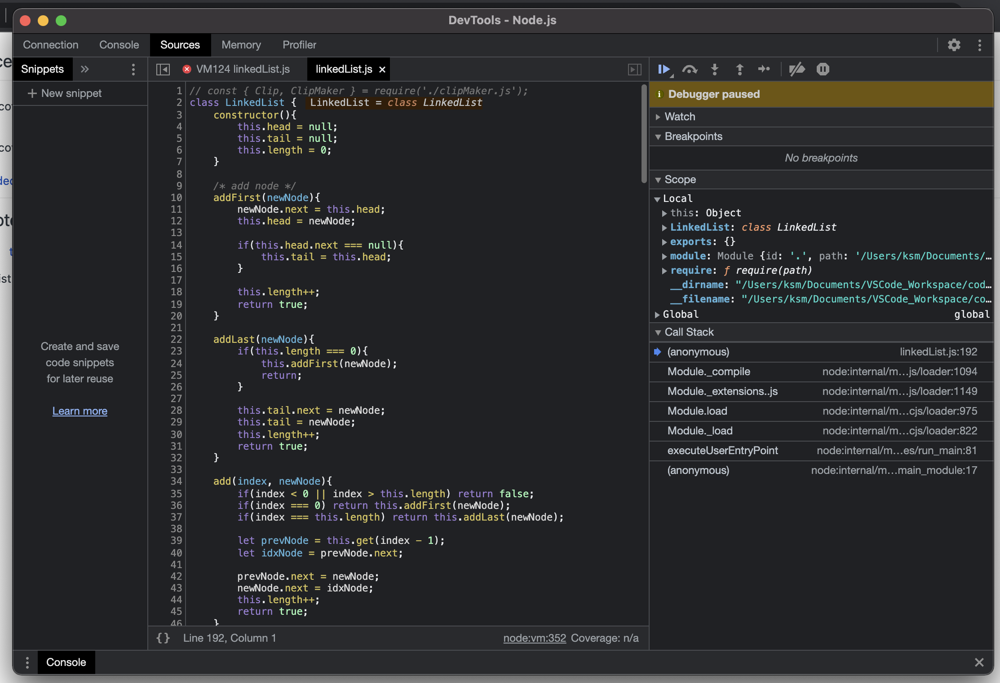

__💡 코드스쿼드 마스터즈 CS 과정의 일일 회고글입니다. 현재 글에서 사용 중인 일일 회고의 양식은 [<U>일일회고 양식 ver.코드스쿼드</U>](https://hemudi.github.io/diary/daily-retrospective-form/)를 참고해주세요.__
{: .notice--warning}

# __💭 Daily Step__
## __✓ BACK STEP__
### __늘어지는 하루__
- 오늘은 뭔가 늘어지는 하루였다.
- 알고리즘을 푸는 날이라 그런지 미션을 풀때의 긴장감도 크게 느껴지지 않았고 조별 분들과의 이렇다할 활동도 딱히 없다보니 그냥 하루가 밍숭맹숭 흐느적거리며 지나갔다.
- 알고리즘 문제도 다 풀고 나니 뭔가 진이 빠져서 더이상 추가 공부를 하지 않고 어제 읽던 `읽기 좋은 코드가 좋은 코드다` 책을 그냥 계속 쭉 읽었다.
- 해야 할 일은 분명 많이 있는데 뭔가 다 손이 안갔다.

## __✓ ONE STEP__
### __알고리즘 문제 풀기__
- 오늘 나온 알고리즘 문제 6개는 대부분 코코아때 풀어봤던 문제였다.
- 그래서 풀까 말까 고민을 하는데 칸이 이미 푼 문제지만 새롭게 풀어서 예전에 푼 코드와 비교해보신다고 하셔서 좋은 생각인거 같아 나도 전부 다시 풀어봤다.
- 대신 이미 한번 푼 문제니까 시간 제한을 두고 측정을 하면서 풀었는데 내가 생각한거보다 빠르게 문제를 풀어서 조금 놀랬다.
- 근데 예전 코드와 비교하니 발전한 구석은 별로 보이지 않아서 조금 눈물...__(›´ω`‹ )__
- 그래도 이미 풀었던 코드들은 전부 다 예상보다 빨리 풀었고, 풀어본적 없던 연결리스트 관련 두 문제도 풀 수 있을까 싶었는데 어떻게든 스스로 풀어내서 만족스럽다.

### __inspector__
- 어제 Next todo에 썼던대로 node 디버깅 옵션 중 하나인 inspector 가 지난 달까지는 됐는데 이번에는 왜 안됐는지에 대해서 찾아봤다.
- 공식 문서도 더듬더듬 읽어보고 구글링도 열심히 했는데 딱히 이렇다할 내용은 없었다.
- 그래서 뭐지 왜 안되는거지 하면서 다시 돌려봤는데

- 됨...
- __3 _3)?__
- 이게 뭐지 싶지만 그래도 되니까 다시 사용법에 대해 정리도 대강 해놨다. 주말에 포스팅해야지!

## __✓ NEXT TODO__
- [ ] 배열의 객체화
  - 조금 전에 도니가 알려줘서 파크의 알고리즘 풀이를 보러갔는데 너무 신기한 풀이를 봤다.
  - 배열을 객체화 시켜서 사용하는 방법이라는데 알고리즘 스킬이 이런건가 싶었다.
- [ ] JavaScript ES6
  - 오늘 알고리즘을 풀면서 느꼈는데 ES6의 문법들에 대해 좀 더 제대로 공부하고 활용을 해봐야겠다 싶었다.
  - 대강 이런 이런게 있고 대강 이런 느낌이구나를 책으로만 접하고 사용을 제대로 해보질 않으니 막상 써먹을때가 되었는데도 바로 생각이 나지 않았다.
  - JavaScript 기본기 공부가 필요하다...ㅠ
  
 
---
 

# __💬 주절주절__
### __마스터즈 커뮤니티 이벤트__
오늘은 오전 10시부터 11시 조금 넘을때 까지 마스터즈의 모든 수강생들과 매니저인 클로이, 그리고 세 분의 마스터와 함께 줌에서 소통하는 시간을 가졌다. 아쉽게도 크롱은 개인 일정으로 참가하지 못하셨다. 시작하기 전에 클로이께서 만드신 퀴즈도 풀었는데 잠도 깨고 내용도 너무 재밌었다.  

### __빠르게 대충 여러번__
그 후 QnA 로 소통을 했는데 가장 인상 깊었던 답변은 효율적인 학습을 위한 시간 관리 질문에 대한 Ivy 마스터님의 답변이었다.  

Ivy 마스터님은 본인께서 공부를 하실때 절대적인 목표를 정하려고 하지 않으시고 __빠르게 대충__ 학습하고 그걸 __여러번__ 보려고 노력하신다고 하셨다.  

최근들어 어떻게 효율적으로 학습을 할 수 있을지 고민을 많이 했는데 그 고민에 대한 해답이 된거 같다. 내 성향이 완벽하게 해내지 못할거 같으면 시작도 못하는 게으른 완벽주의자...인척하는 진짜 그냥 게으른 성향인데 빠르게 대충, 여러번 학습하는 방법이 나에게 잘 맞을거 같다는 생각이 들었다.  

### __개발자에게 가장 중요한 요소__
소통 시간의 마지막 질문은 개발자에게 가장 중요한 요소가 무엇인가였다. Ivy 마스터께선 현실적으로 체력이 가장 중요하다고 하셨고, 호눅스 마스터는 끝없는 호기심 그리고 마지막으로 JK 마스터께선 자기 균형, 자기 관리 등이 중요하다고 하셨다. 내가 생각하는 개발자에게 가장 중요한 요소는 뭘까.  