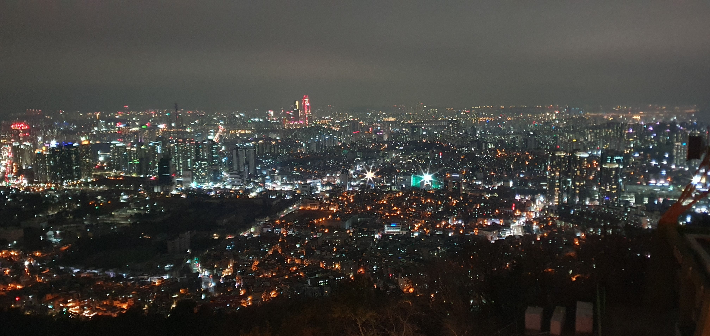

__💡 코드스쿼드 마스터즈 CS 과정의 일일 회고글입니다. 현재 글에서 사용 중인 일일 회고의 양식은 [<U>일일회고 양식 ver.코드스쿼드</U>](https://hemudi.github.io/diary/daily-retrospective-form/)를 참고해주세요.__
{: .notice--warning}

# __💬 주절주절__
## 오랜만의 나들이
주말동안 서울로 놀러다녀왔다.  
용산에서 스파이더맨 4DX를 관람하고 파스타를 먹고 호텔에서 놀다가  
친구가 남산 타워에 한번 가보고 싶다해서 토요일 밤에 함께 남산을 올랐다.  
어릴때 갔던 이후로 오랜만에 가서 어렴풋이 기억이 나면서도 낯설어 친구랑 여기저기 쏘다니며 구경했다.  

높은 곳에서 내려다보는 서울의 야경은 좀 멋있었다.  
사진을 찍으면서 올해 안에 저 풍경의 어딘가에서 일을 하고 있을 수 있다면 좋겠다 생각을 했다.  
그렇게 산책하는 기분으로 남산타워 구경도 하고 다시 호텔로 돌아와 맛난것도 먹고 힐링을 했는데  
솔직히 노는 내내 해결 못한 미션이 머리에서 아른거려서 마냥 편하진 못했다.  

그래서 결국 친구에게 양해를 구하고 챙겨온 아이패드를 꺼내 코딩은 못해도 설계를 끄적거렸다.  
친구도 개발자라 이번 미션에 대해서 두런두런 얘기도 좀 하면서 끄적거리다보니 어찌저찌 설계를 완성했고 조금은 편히 잘 수 있었다.  

그 뒤 일요일에 친구랑 일찍 헤어지고 집에와서 코딩을 마저 하려고 했는데  
또다른 약속이 생겨 잠실로 향했고 집에 돌아오니 밤 11시가 다되어 있었다.  
결국 주말내내 밀린 미션도 못해내고 놀기만해서 죄책감이 가득하지만...  
그래도 앞으로 더 바빠질텐데 또 언제 이렇게 놀겠나 싶어서 후회는 안된다...ㅠ    

후회는 안되는데...생각보다 무리를 좀 해서 내일의 컨디션이 걱정되고...  
또 내일 나오는 새 미션이 좀 걱정된다...  
아직 지난번 미션도 완성을 못했는데ㅠ...  
제발 풀만한 미션이 나왔으면ㅠ  