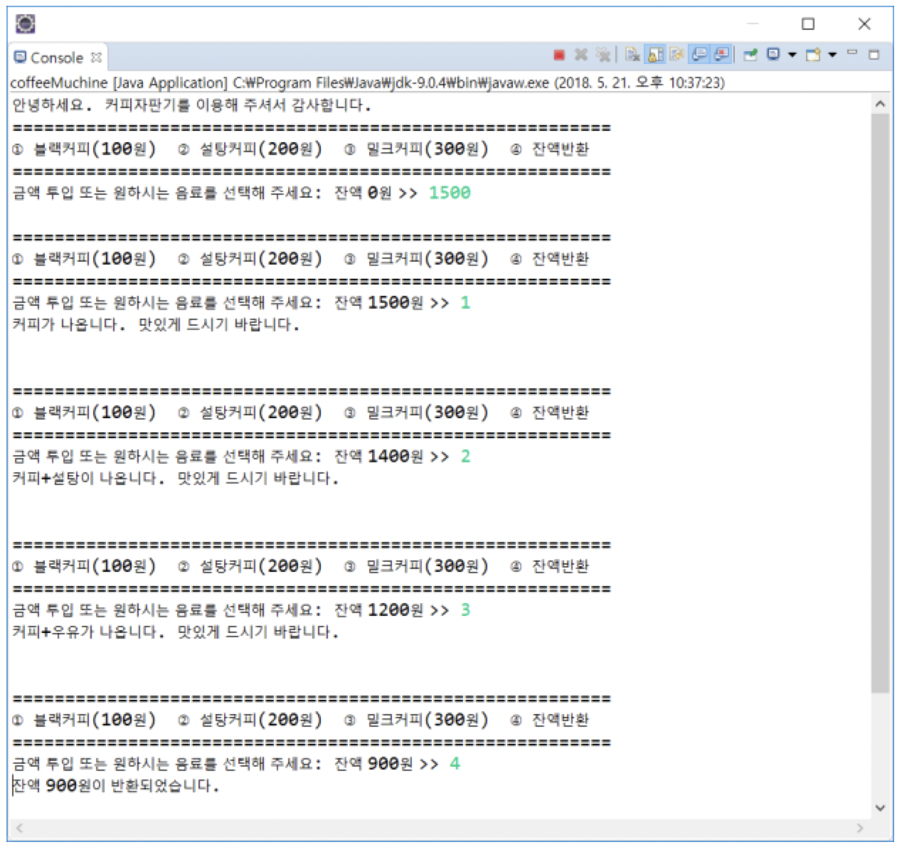
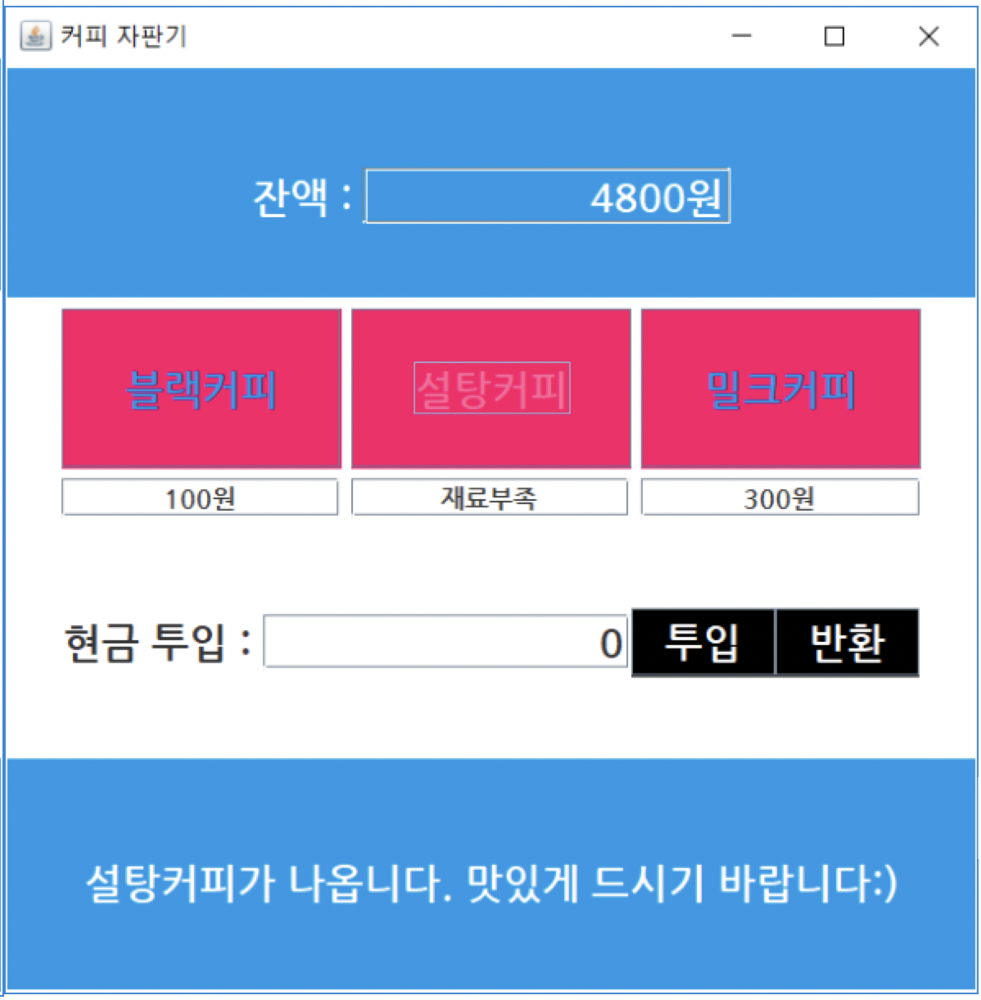
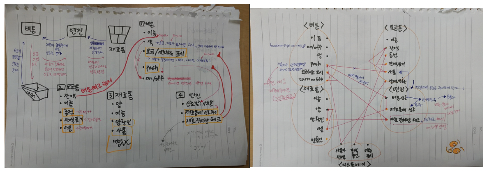

## __✓ 01/26 ~ 01/28__
### __회고를 못썼다...__
cs 과정동안 일일 회고를 꾸준히 쓰는게 목표였는데 방학 전 3일 동안 회고를 못 썼다.  
하루 정도 밀리면 그냥 기억을 더듬어서 쓰는데 거의 일주일이 밀린 탓에 기억도 가물거려 도저히 못쓰겠다...ㅎ  
그래서 결국 방학 회고에 짧게 퉁치기로 했다...  

### __01/26__
알고리즘 날이었다.  
다른 분들의 예상대로 HackerRank 의 문제가 나왔는데  
제발 제발 나오지 않았으면 했던 캥거루 문제가 나왔다!  
보자마자 뜨악했는데 막상 다시 보고 풀어보니 3분만에 풀었다.  
접근법의 문제였다....  
넘나 허탈...했지만 옛날에는 못풀었던 문제를 풀고 나니 자신감이 생겨 팍팍 풀다가  
죄수들 사탕 나눠주는 문제에서 다시 좌절해버렸다...  

### __01/27__
역대급 난이도의 미션에 당황한 날이었다.  
미션 요구사항에 명시된 난이도도 __최상__ 이였다.  
지금까지 cs 과정에서 배운 내용들을 종합해서 푸는 미션 같은 느낌이었다.  
그래도 미션의 주 내용이 나는 비동기라고 생각을 해서 JavaScript 의 비동기에 대해 하루종일 공부했던거 같다.  
근데 막상 미션을 구현하기 시작하니 주요 포인드는 비동기가 아니고 객체 설계인가 싶은 기분이 들어서 결국 미션 1 구현했던걸 다 지우고 설계부터 다시 시작했다.  
그래서 본격적인 구현 시작은 정규시간이 끝난 뒤...  
게더 야자를 하면서 어찌저찌 미션 1은 전부 구현해냈다.  
아 그리고 구현을 하다 재밌던 일이 있었는데 터미널에서 비동기적으로 입출력을 시키려고 했더니 입력 형식이 어그러지는 문제가 있었다.  
즉 입력을 받기 위해 프롬프트를 띄웠는데 다른 어딘가에서 console.log 를 호출해 출력을 하면  

```js
주문 > 
Barista 1 : A - 프라프치노 제작 시작!
|
```

저렇게 깨지는데 그래도 저 마지막의 커서 위치에서 입력을 하면 제대로 작동이 되긴 한다...  
하지만 저게 너무 맘에 안들었고...  
어떻게 해결하지 싶어서 구글링을 열심히 하다가 슼오플에서 아래의 글을 발견했다.  

[How can I avoid overlapping readline and console.log in node](https://stackoverflow.com/questions/65891912/how-can-i-avoid-overlapping-readline-and-console-log-in-node)  

제목이 딱 내가 원하던 질문이라 호다닥 들어갔는데...들어가자마자 익숙한 글자들이 보였고...  
설마 했더니 코드스쿼드 작년 기수 선배님의 질문글이었다...!!  
작년에도 나랑 같은 고민을 하셨던 분이 계셨구나 싶어서 넘 재밌었다ㅎㅎ  

답변도 딱 내가 원하던거라 가져와서 활용해봤다!  
질문 올려주셔서 감사합니다 슨배님 ^-^)7  

### __01/28__
수업이 알찼다.  
JK께서 설계를 어떻게 하셨는지를 단계별로 설명해주셔서 많이 참고도 되었고 넘 좋았다.  
게더 야자 하느라 잠을 못자서 비몽사몽하며 듣긴했지만 알찼다는건 확실하다!  
그래서 수업을 좀 참고하면서 설계를 뒤집어 엎을라고 했는데  
오후에 그룹 리뷰가 있으니 그냥 설계를 유지하고 미션 2까지 해내자 싶어서 일단 구현을 했다!  
어찌저찌 완성을 하긴 했는데...여전히 고민거리가 많이 남아서 방학 중에도 계속 고민 중이다...  

## __✓ 방학회고__
### __방학 계획 + 스터디__
이 회고글을 쓰는 날은 2월 4일...  
아직 방학이 이틀 남긴 했지만 거의 끝난거나 다름 없어서 지금 쓴다...  
방학 하기 전에 스터디도 계획하고 이거도 하고 저거도 하고 열심히 할 의욕에 가득 찼었는데...  
설날이라는 복병이 있었다...  
한국의 대명절...설날...  
이번 명절에는 코로나 때문에 친척 분들도 안오셔서 당연히 제사도 안할거라 생각했고 그렇게 들어서 스터디에 참여도 한거였는데 우리끼리라도 제사를 지내자는 말이 나왔고 급하게 제사 준비를 시작해서 진짜 정신이 없었다.  
그 탓에 스터디에도 제대로 참여 못하고 결국 스터디는 흐지부지 된거 같다ㅠ  
함께 스터디를 하기로 했던 분들께 넘 민폐를 끼친거 같아서 죄송하고ㅠㅠ  
처음부터 제대로 명절의 특수성을 고려해서 스터디를 계획했으면 좋았을텐데라는 아쉬움이 남는다...ㅠㅠ  

### __살크업__
제사를 치룬 탓에 제사 음식이 집에 그득 쌓였고 그건 그대로 내 살이 되었다...^^...  

### __자바스크립트의 기본__
제사 지내고 뭐하고 하다보니 방학이 금세 지나가버렸다.  
애매하게 남은 기간동안엔 뭘 하지 고민이 됐는데  
그냥 자바스크립트의 기본이나 닦자 생각하고 딥다이브와 코어 자바스크립트 책을 번갈아가며 보고 있다.  
거기에 플러스로 좀 심심해지면 객체지향의 사실과 오해 책을 다시 읽고 있다.  
딥다이브와 코자스를 보면서 느끼는데 자바스크립트는 정말 알다가도 모르겠다.  
이해했다 싶은데 막상 다시 보면 이게 뭐야 싶고...  
하여튼 아마 남은 이틀인 토, 일도 JS 기본기 위주로 공부하지 않을까 싶다.  

## __✓ 주절주절__
### __Once Upon a Time__
마지막 미션을 하면서 옛날에 대학교에서 객체지향에 대해서 공부할때가 생각났다.  
그때 첫번째 과제로 간단한 커피 자판기 프로그램을 만들었었다.  

<p align="center">
  
</p>
<p align="center">

</p>

ㅋㅋㅋㅋㅋㅋㅋㅋㅋㅋㅋㅋㅋㅋㅋㅋㅋㅋㅋㅋㅋㅋㅋㅋㅋㅋㅋㅋㅋㅋㅋㅋㅋㅋㅋㅋㅋㅋㅋㅋ  
위에건 이클립스 콘솔창에서 구현한거고 아래건 JavaFX 를 써서 GUI 까지 구현해본거다.  
형형색색한 자판기를 보니 내가 정말 프론트엔드를 해도 되는건가 싶은 생각이 든다...  
저때는 정말 Java도 처음배우던 때라서 날밤새면서 겨우 구현했는데  
최근의 cs 미션에 비하면 진짜 걸음마 수준의 프로그램인거 같다.  

<p align="center">

</p>

이건...당시에 커피 자판기를 구현하기 위해 고민한 흔적...? 같은건데  
당시 객체지향 강의를 해주시던 교수님께서는 구현의 완성도보다 과제를 하면서 뭘 깨닫고 배우고 느꼈는지를 더 중요시 하시던 분이라 레포트의 마지막에 소감을 따로 쓰면 좋아하셨다.  
그래서 소감에다가 객체지향 설계하려고 머리 뽀샤지게 고민했다는 흔적으로 첨부했던거다.  
(근데 제출 마감이 되자마자 ㄹㅇ 찐 낙서한게 그대로 들어가 있는걸 뒤늦게 발견하고 충격과 공포...)  

코드스쿼드를 하면서 이렇게 종종 옛날에 만들었던 프로그램들이 문득 문득 생각날때가 있는데  
찾아서 보게 되면 너무 재밌고 내가 좀 발전했구나 싶은 부분도 있고 여전하구나 싶은 부분도 있어서 여러 생각이 들게 된다.  
다만 아쉬운 점이 있다면 코드를 제대로 정리해두지 않아서 찾는데 시간도 오래걸리고 결국 코드는 못찾고 레포트만 찾을때가 있다는 것...!  
그럴때마다 앞으로 짤 코드들은 모두 소중하게 깃허브에 보관해두고 리드미도 잘 정리해두자는 다짐을 하게 된다.  
더불어 회고도 잘 쓰자!  

이제 방학이 끝나면 마지막 CS 주 이후 본격적으로 프론트엔드 과정이 시작되는데  
방학동안 펑펑 논 만큼 다시 의욕을 다져 열심히 하자!  
꼬박꼬박 일일 회고부터!  

## ECT...


자판기 과제를 보니 1학년 때 기초 웹 강의에서 했던 인생 첫 웹 프로젝트도 궁금해져서 당시 같은 조였던 동기한테 파일을 받아서 실행시켜봤다ㅋㅋㅋㅋㅋ그런데 어엌ㅋㅋㅋㅋㅋㅋㅋㅋㅋ나 진짜 프론트엔드 해도 되는걸까?ㅋㅋㅋㅋㅋㅋㅋㅋㅋㅋㅋㅋㅋ  

동기 둘이랑 같이 날밤 새면서 만든건데 당시에 진짜 CSS가 너무 어려워서 고통 받았던 기억이 난다.  
특히나 드롭다운 메뉴 구현하는데 정말 정말 진짜 너무...너무 힘들었다...  

그래서 저 프로젝트가 끝나고 절대로 다시는 웹 개발을 하지 않겠다 다짐하고 웹 개발 관련 강의는 아예 신청조차 안했는데  
몇년 뒤 프론트엔드를 지망하게 될줄이야...^///^)>  
심지어 요즘엔 CSS 도 조금 즐기고 있다.  
미래는 역시 알 수 없는거 같다...ㅎ  