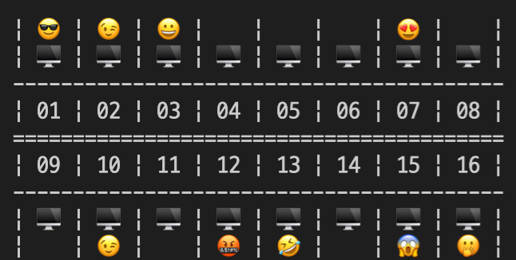

__💡 코드스쿼드 마스터즈 CS 과정의 일일 회고글입니다. 현재 글에서 사용 중인 일일 회고의 양식은 [<U>일일회고 양식 ver.코드스쿼드</U>](https://hemudi.github.io/diary/daily-retrospective-form/)를 참고해주세요.__
{: .notice--warning}

# __💭 Daily Step__
## __✓ BACK STEP__
### __어제도 쉬었는데__
- 오늘도 쉬었다.
- 다들 그러신 분위기길래 나도 슬쩍 묻어가서 쉬었다.

### __미션 2__
- 그래서 미션 2의 진도가 안나갔다.
- 새로 오픈해서 손님들이 많이 와주셨는데 손님들이 자리에 박혀서 나가질 않으신다ㅋㅋㅋㅋㅋㅋㅋㅋㅋㅋ
- ^-ㅠ 적당히 하고 나가주세요 흑흑

## __✓ ONE STEP__
### __깐부 프로그래밍 체험__
- 오늘 짝 프로그래밍 워크숍으로 처음으로 룰이 정해진 페어 프로그래밍을 경험해봤다.
- 랜덤으로 둘씩 짝이 되었는데 나는 지미랑 짝이 되었다.
- 게더에서만 뵙던 지미를 줌에서 보는건 언젠가 같은 조가 됐을때라고 생각했는데ㅋㅋㅋㅋ이렇게 둘이서만 줌에서 뵙게 될줄 몰랐다.
- 너무 당황하기도 하고 어색하기도 하고 주어진 문제도 생각보다 간단하게 뚝딱 할 수가 없는 문제라 진짜 어질어질했다.
- 검색하는거도 네비게이터가 드라이버에게 시켜야되는거 같아서 크롬창 좀 켜주세요 위로 좀 올려주세요 아 죄송해여 내려주세요ㅠ 를 몇번이나 말했는지 모르겠다.
- 예전에 서울에서 밀리랑 만나 알고리즘 문제를 짝 프로그래밍으로 한번 도전해봤었는데 룰을 정해서 해보니 그때보다 어려운거 같으면서 집중력이 적절히 분배가 되는 느낌이라 좀 더 몰입도가 있었던거 같다.
- 75분의 제한이 있었는데 시간이 진짜 쏜살같이 지나가서 너무 놀랬다.
- 어질어질 했는데 진짜 너무 재밌었다.
- 지미가 저희 지금 스피드 퀴즈 하나요 했는데 ㄹㅇ이였다ㅋㅋㅋㅋㅋ
- 그래서 하나 느낀건 짝 프로그래밍을 할때 지시대명사의 사용을 줄여야겠다 싶었다.
- 네비게이터를 할때 나도 모르게 내 시점에서 그쪽 아래에~ 저기 위에~ 라는 식으로 말을 하니 듣는 드라이버 입장에서는 어디를 기준으로 하는지 몰라 당황하시니까... 지시대명사를 쓰는 순간 ㄹㅇ 스피드 게임, 눈치 게임이 되버리는거 같다...ㅋㅎㅎ휴ㅠㅠ
- 여기 저기 그쪽의 사용을 줄이고 명확하게 '몇번째 라인의 어느 부분' 이런 식으로 짚어서 설명을 드리는게 나은거 같다.
- 다음엔 좀 더 차분하게 마인드 컨트롤을 하고 다시 도전해보고 싶다.

## __✓ TODAY DONE__
- 페어 프로그래밍
- HTTP 찍먹

## __✓ NEXT TODO__
- HTTP...

---
# __💬 주절주절__
### __커뮤니티 이벤트__
- 오늘 오후 7시 30분부터 1시간 동안 클로이 주최로 3분의 수료생 분들과 함께 하는 밋업 이벤트가 있었다.
- 다들 정말 열심히 노력하신게 보이는 분들이었고 그만큼의 성과를 이루신 분들이라 너무 멋있어보였다.
- 1시간 동안 QnA 를 위주로 진행되었는데 정말 많은걸 배우고 깨달았다.
- 선배님들의 말씀을 들으며 더더욱 마지막 CS 미션 만큼은 너무 무리하지 말고 HTTP 에 대해서 잘 모르는 만큼 학습을 중점으로 진행해보자 다짐하게 됐다.
- 미션을 구현 못한다고 실패한게 아니니까!
- 그리고 또 저렇게 누군가에게 도움이 될 수 있을만한 사람이 되고 싶다고도 느꼈다. 꼭 개발 관련 분야가 아니더라도!
- 느낌으로 생각으로 두지 말고 열심히 노력하자!

### __아침 회고__
- 이전에 다짐한대로 8일의 회고를 지금 9일 오전에 쓰고 있다.
- 아침 회고 2일차인데 확실히 밤에 쓸때보단 덜 감성적이 되는건 있는거 같다.
- 하루의 시작을 회고로 하는게 잠에서 깨는거에도 도움이 되는거 같고! 좋은거 같다!
- 다만 회고글의 시점을 9일에 쓴다는걸 의식하고 어제라고 써야 할지 오늘이라고 써야할지 고민이 됐다...ㅋㅋㅎㅎㅋㅋㅎ
- 근데 어차피 이번 미션만 하면 CS 과정이 끝나고 FE 과정이 시작되니까 CS 회고까지만 대충 당일에 쓰는것처럼 쓰기로 하고 FE 과정이 시작되면 그때 아예 회고 양식을 아침 회고로 수정해서 쓰면 될거 같다.
- 야호 ~(^ - ^)~